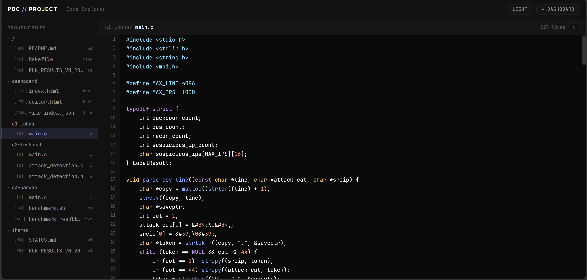

# PDC Console


PDC Console is a Parallel and Distributed Computing project for intrusion-detection analysis on the UNSW-NB15 dataset. It combines MPI-based C programs, a dashboard-style presentation UI, and a code explorer that documents how the work was structured and evaluated.

- Live dashboard: https://pdc.onichealth.com/
- Repository: https://github.com/Haseeb-1698/pdc-console



## What This Project Demonstrates

The project was implemented around three parallel-computing tasks:

- Q1: Parallel detection of Backdoor, DoS, and Reconnaissance records.
- Q2: Cross-process suspicious-IP correlation and validation.
- Q3: Serial vs parallel performance measurement.

The system was evaluated on a 3-node MPI setup with one master node and two worker nodes. The dashboard presents the run flow, command outputs, benchmark summaries, and source files used during the project.

This repository is a presentation and research package. The UI and source layout can help other students build a similar dashboard and MPI workflow, but anyone reusing it should add their own dataset, cluster configuration, and result content for their own work.

## Dataset

The project uses UNSW-NB15 network traffic data. The main files used during evaluation were:

- `UNSW_NB15_training-set.csv`
- `UNSW_NB15_testing-set.csv`
- `UNSW_NB15_combined.csv`
- `UNSW-NB15_1.csv` to `UNSW-NB15_4.csv`

Q1 and Q3 use the labelled training/combined files for attack-category counting. Q2 uses the split raw CSV files to demonstrate distributed suspicious-IP correlation across MPI ranks.

## Approach

### Q1: Parallel Malicious Activity Detection

Q1 reads the labelled CSV data, splits records across MPI ranks, and counts three selected attack labels:

- Backdoor
- DoS
- Reconnaissance

Each rank processes its chunk independently. The global totals are produced with MPI reduction, and suspicious IP candidates are gathered and deduplicated.

### Q2: Distributed Suspicious-IP Correlation

Q2 focuses on communication patterns and validation. It uses multiple MPI collectives to distribute work, aggregate suspicious activity, validate rank-level processing, gather variable-sized suspicious-IP lists, deduplicate results, and broadcast the final authoritative list.

MPI concepts used:

- `MPI_Scatter`
- `MPI_Reduce`
- `MPI_Allreduce`
- `MPI_Gather`
- `MPI_Gatherv`
- `MPI_Bcast`
- custom MPI datatype for suspicious-IP records

### Q3: Performance Analysis

Q3 compares serial and parallel execution using `MPI_Wtime`. It records:

- serial execution time
- parallel execution time
- per-rank counts
- communication overhead
- speedup
- efficiency
- checksum verification

The checksum verifies that the parallel result matches the serial baseline.

## Key Findings

The selected labels had relatively little useful computation compared with the cost of distributing work. For the chosen target labels, the computation per rank was very small, while MPI scatter, gather, reduce, and synchronization overhead dominated the runtime.

Because of that, this workload was communication-bound. The parallel version did not beat the sequential baseline for the selected Backdoor, DoS, and Reconnaissance analysis. A sequential implementation was more efficient for this exact problem size and label choice.

This does not mean parallelism is always worse. If the task used larger data, more expensive feature extraction, heavier labels, model inference, or broader attack categories, the balance could change. The result here shows that parallelization must match the workload size and computation cost.

## Results

Q1 and Q3 produced matching attack totals on the UNSW-NB15 training dataset:

| Metric | Value |
|---|---:|
| Records | 82,332 |
| Backdoor | 583 |
| DoS | 4,089 |
| Reconnaissance | 3,496 |
| Total attacks | 8,168 |

Q2 distributed correlation results from the final run:

| Metric | Value |
|---|---:|
| Unique suspicious IPs | 36 |
| Failed logins | 468,828 |
| Port scans | 183,521 |
| Connections | 339,807 |
| Validation | PASSED |

Performance conclusion:

- The workload was communication-bound.
- Speedup remained below 1x for the measured runs.
- MPI overhead was larger than the useful computation for this label-selection task.
- The experiment still demonstrates correct MPI coordination, validation, and result aggregation.

## Build and Run

The repository includes the source files used for the research presentation. To reproduce the computation, prepare your own Linux/OpenMPI environment and place the UNSW-NB15 dataset files under a `dataset/` directory.

Compile:

```bash
make
```

Run Q1:

```bash
mpirun -np 4 ./q1 dataset/UNSW_NB15_training-set.csv
```

Run Q2:

```bash
mpirun -np 4 ./q2
```

Run Q3:

```bash
mpirun -np 2 ./q3 dataset/UNSW_NB15_training-set.csv
```

For a multi-node setup, create your own MPI hostfile and make sure all nodes have the same project files, compiled binaries, dataset files, OpenMPI version, and passwordless inter-node SSH configured for MPI.

## Project Structure

```text
.
|-- dashboard/
|   |-- index.html
|   |-- editor.html
|   |-- file-index.json
|   |-- img1.png
|   `-- img2.png
|-- q1-Lubna/
|   `-- main.c
|-- q2-Insharah/
|   |-- main.c
|   |-- attack_detection.c
|   `-- attack_detection.h
|-- q3-haseeb/
|   |-- main.c
|   |-- benchmark.sh
|   `-- benchmark_results.csv
|-- shared/
|   |-- STATUS.md
|   `-- RUN_RESULTS_VM_2026-04-02.md
|-- PDC_3_NODE_SETUP_RUNBOOK.md
|-- RUN_RESULTS_VM_2026-04-02.md
|-- Makefile
`-- README.md
```

## Related Documentation

- `PDC_3_NODE_SETUP_RUNBOOK.md`: sanitized summary of the 3-node MPI setup and what was actually done.
- `RUN_RESULTS_VM_2026-04-02.md`: result tables used in the dashboard.
- `shared/STATUS.md`: question-wise project status summary.
